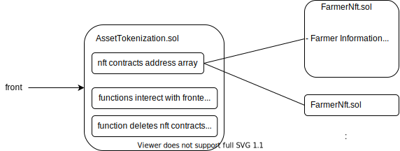

# dapp概要

農家の会員権をトークン(NFT)化し購入できるアプリ。

農家は会員権をトークン化することで, 収益の安定性などを図れる。

購入者はトークンを転売することや, 農家を直接応援することができる。

トークンはあらかじめ設定された期限で自動的にバーンされる。

# コード概要

### `contracts/AssetTokenization.sol`:

- データ管理とフロントエンドとのデータやりとり。
- NFTコントラクトのデプロイ, コントラクトのアドレス管理。
- 期限切れNFTのバーンを自動で行うために, chainlinkが用意した`AutomationCompatibleInterface`を実装。

### `contracts/FarmNft.sol`:

- 農家毎にデプロイするNFTコントラクト。

### 全体図

